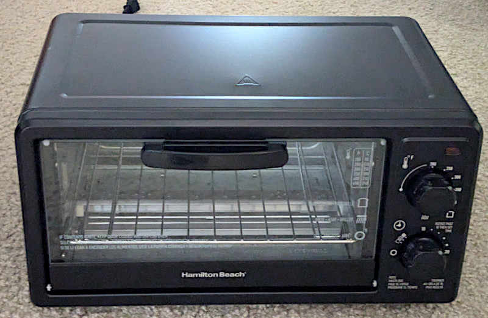
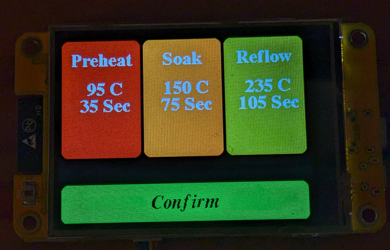
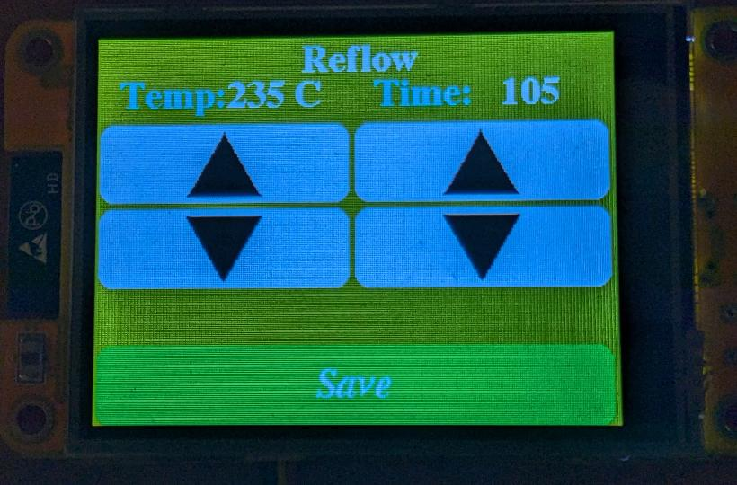
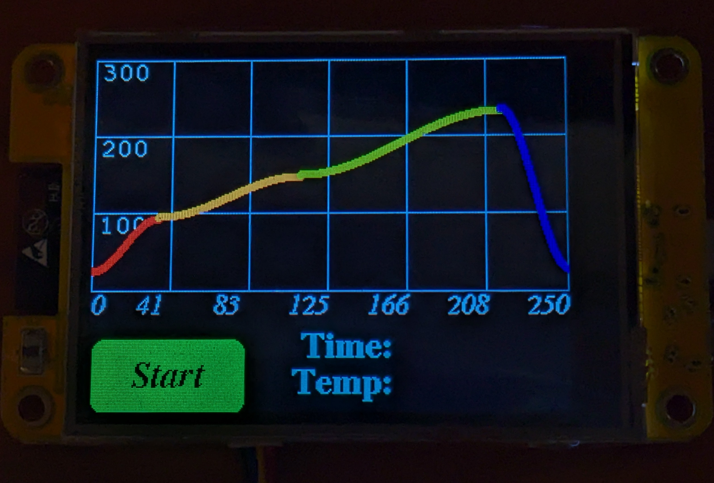
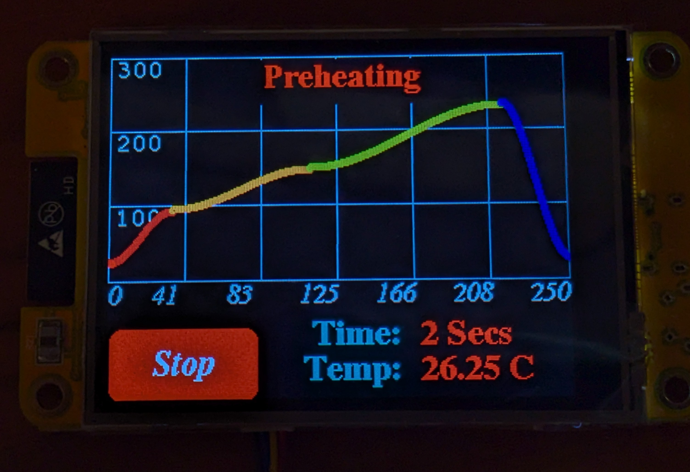
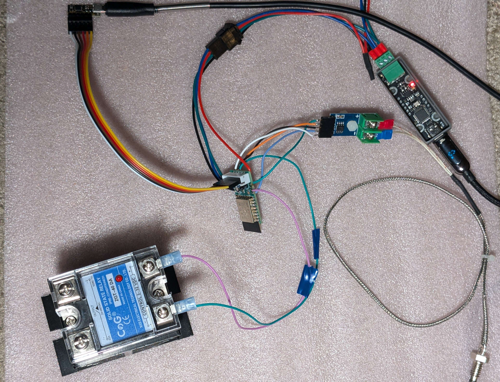
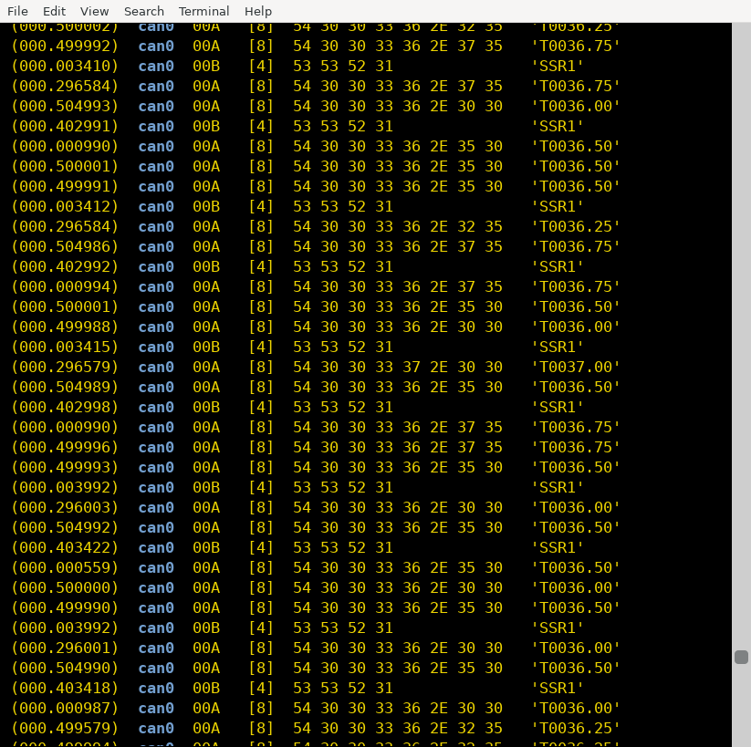
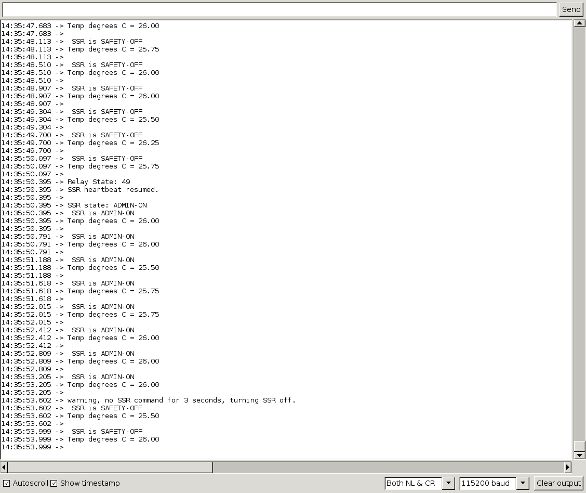
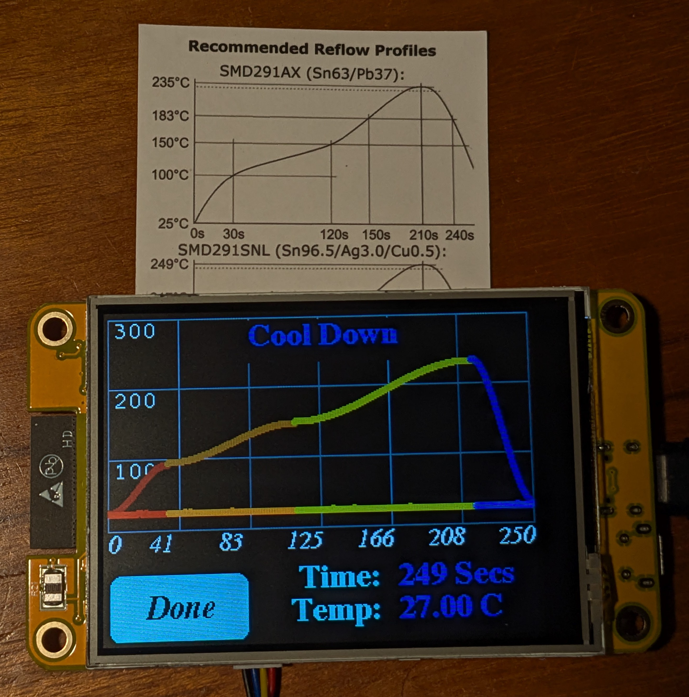

# Toaster Oven Solder Reflow

## Using ESP32, TFT Touch Display, and CANbus for Connectivity

...more to come as I document and finish this project.

# References

My GUI code is strongly based on these other projects:

* https://github.com/bytesizedengineering/Solder-Reflow-Oven/
* https://github.com/aBoyCanDream/Solder-Reflow-Oven

The remote 'pod' code is 100% original (this is what talks to the thermocouple, the ssr and runs the safety disconnect logic)
