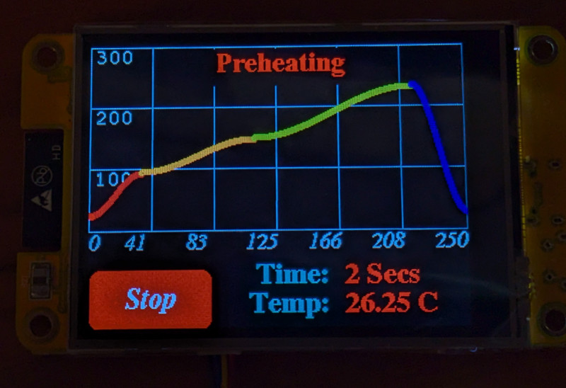

# Toaster Oven Solder Reflow

## Using ESP32, TFT Touch Display, and CANbus for Connectivity

Yet another toaster oven soldering reflow mod.  Using a pair of ESP32 chips, a graphic touch display, a thermocouple, an SSR (solid state relay) and linking a remote 'pod' with the main graphic using CANbus (a high speed and high reliability 2 wire bus).

After the controller was built, one test run:

The curve was close; ramp-up speed of the oven is slow.

## First boot screen

The main menu when you first boot the graphic display.  Select one of the 3 phases to edit the settings or click on Confirm to go to the reflow graph start screen..

## Changing a time or duration for each of the 3 settable phases:

Once you click the red, orange or green 1/3 sections to edit, you are in a screen like this.  You can press on the up and down arrows on the temperature and time columns.  Note, the changes are NOT currently saved to eeprom (a TODO item).  Click 'save' to exit this type of screen.

## Just as you are about to begin:

You are shown a graph with the profile that you either hard-coded or updated via the arrow buttons on a previous edit screen.  Now you can only press 'start'.  (todo: add a 'return' or exit button)

## Now its running!

The user pressed 'start' and now the engine is moving thru time, using the durations for each of the 3 phases (cooldown is not a controllable phase, we can only heat).  (todo: add the servo or stepper motor to open the front glass door at cooldown time).

## The remote 'pod' hardware

This is what I threw together to test it.  I have yet to design any box or even perf board for it yet.  It uses an esp32-c3 (it has enough pins and it supports CANbus).  Any ESP32 would work, though.

There's a thermocouple spi chip (typically found from import sites), an SSR (common type, 3v dc driven since we are 3.3v logic) and in the photo there's also a 'candlelight' usb module that costs about $10 and is open source; it lets you sniff AND SEND to CANbus, so its useful to debug and inject messages).

## CANbus data

I'm using 8byte simple CAN frames, no ISO-TP or anything fancy.  Not even can-fd.  CANbus at 500k is fine.

This is a raspberry pi running candump from the can-utils pkg.

I defined 3 message types:

* #define CANID_REPORT_TEMP       0x0A  //(payload is like 'T0234.75')
* #define CANID_SET_RELAY         0x0B  //(payload is SSR0 or SSR1)
* #define CANID_REPORT_STATUS     0x0C  //(payload is single byte: 0=safety_shutdown, 1=admin_off, 2=admin_on

The payloads are in simple ascii to make debug easier.  No need for extreme tight binary encoding, really.

You can see the 00B messages that say 'SSR1'.  The message will be SSR with a 0 or 1 to tell the remote side if it should be on (1) or off (0).  These messages come from the GUI display and are directed to the remote 'pod'.

You can also see the 00A messages.  These are constant temperature reports from the pod, directed to the gui display.

Finally, (not shown in dump) is the report_status message.  This is an exception sent from the pod to the gui display; its meant to signal if comms were lost and resumed.  It may be of little use so it might not be needed.

On linux, you could create some debug aliases:

  $ alias ron  'cansend can0 00B#53535231'
  $ alias roff 'cansend can0 00B#53535230'
  
Those will send the string 'SSR1' if you type 'ron', etc.  You can run the remote pod (no graphic display on the bus) and use the linux canbus sniffer dongle to inject periodic ssr requests (as if you were 'the pid').

As long as ssr commands keep coming (they should, in normal use) and dont have too long a gap (3 seconds) then the pod happily will follow the SSR0 and SSR1 commands.  But if a timeout happens, it will (as a safety) disable the ssr (turn it off) and log an entry in serial console as well as sending a report_status back to the gui.

## Arduino IDE console debug

Here's some of what you'd see if you have a serial console on the remote 'pod' side.  You can test the state machine by using cansend on linux (etc).

## Paper profile matches the gui

Its not a perfect match, and I have not tried it in real life yet, but it looks close enough to what I should use for leaded solder.

# References

My GUI code is strongly based on these other projects:

* https://github.com/bytesizedengineering/Solder-Reflow-Oven/
* https://github.com/aBoyCanDream/Solder-Reflow-Oven

The remote 'pod' code is 100% original (this is what talks to the thermocouple, the ssr and runs the safety disconnect logic)
